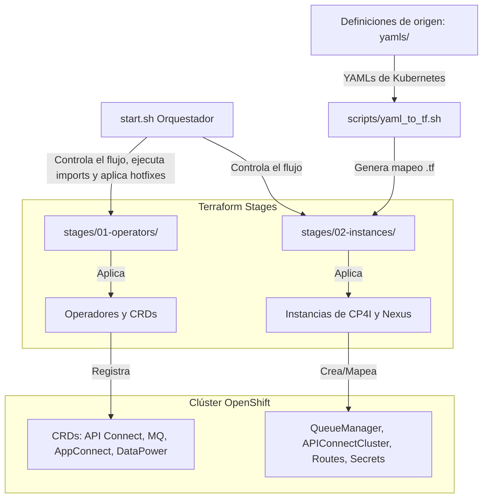
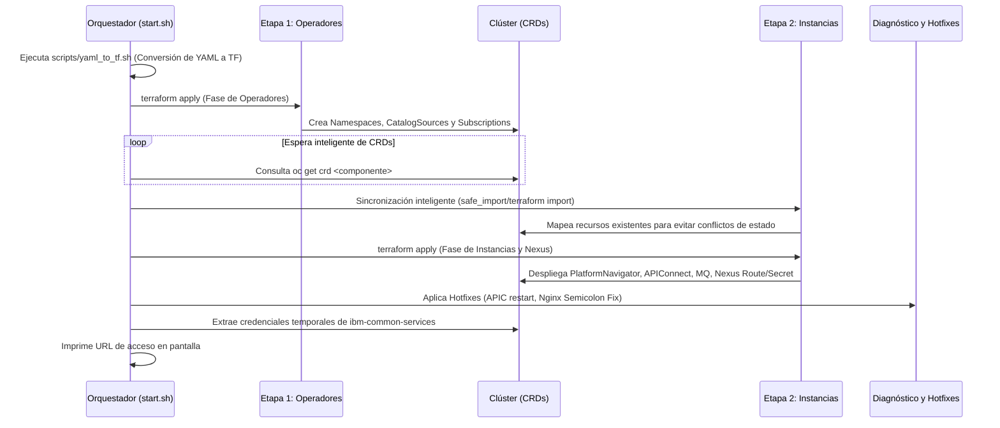

# IBM Cloud Pak for Integration (CP4I) - Infraestructura como Código (IaC)

Este proyecto proporciona un framework automatizado para desplegar entornos de IBM Cloud Pak for Integration (CP4I) y componentes asociados (como Sonatype Nexus) en clústeres de Red Hat OpenShift utilizando Terraform.

---

## 🏗️ Arquitectura del Proyecto

El siguiente diagrama ilustra cómo se estructuran las definiciones de recursos, el proceso de automatización y su despliegue final en el clúster de OpenShift:



---

## 🎯 ¿Qué busca y qué logra este proyecto?

### Objetivos (Qué busca)
1. **Despliegues 100% Repetibles**: Evitar la configuración manual a través de la consola web de OpenShift.
2. **Abstracción de Recursos**: Permitir a los desarrolladores y administradores definir recursos en YAML estándar y mapearlos automáticamente a Terraform mediante un script transpilador (`yaml_to_tf.sh`).
3. **Resolución Automatizada de Errores Comunes**: Evitar que el despliegue falle o se detenga debido a bugs conocidos de los operadores de IBM (como bloqueos de reconciliación o fallos de sintaxis en plantillas).

### Resultados (Qué logra)
* **Instalación sin Fricción**: Despliegue secuencial de operadores e instancias con un solo comando.
* **Auto-sincronización de Recursos Existentes**: Ejecución de importaciones de estado inteligente (`terraform import`) para recursos que ya existían previamente en el clúster, evitando errores de duplicidad.
* **Hotfixes Integrados**: Detección y corrección en caliente de fallas de configuración.
* **Reporte de Credenciales**: Extracción automática de la URL de administración del Platform Navigator y las contraseñas temporales iniciales creadas por OLM.

---

## 🔄 Flujo de Ejecución y Orden de Despliegue

El despliegue está dividido en fases lógicas para cumplir con las dependencias de los recursos personalizados (Custom Resources) en Kubernetes:



---

## 📁 Estructura del Directorio

```
iac-cp4i/
├── yamls/                        # Manifiestos de Kubernetes originales (Fuente de Verdad)
│   ├── ACE/                      # Integración AppConnect (Dashboards)
│   ├── APIC/                     # Configuración del cluster de API Connect
│   ├── DP/                       # Configuración y Route de DataPower
│   └── NEXUS/                    # Configuración de Sonatype Nexus (Route, Secret, barauth)
├── stages/                       # Código de Terraform organizado por fases
│   ├── 01-operators/             # Terraform para namespaces, catálogos y operadores
│   └── 02-instances/             # Terraform para las instancias del Pak y automatizados
│       └── z_auto_*.tf           # Archivos generados dinámicamente
├── scripts/
│   └── yaml_to_tf.sh             # Transpilador de YAML a Kubernetes Manifest de Terraform
├── start.sh                      # Script orquestador principal
└── README.md                     # Esta documentación
```

---

## ⚙️ Integración con Sonatype Nexus

Para soportar el ciclo de vida de los paquetes de integración (`.bar`), se han integrado los recursos de Nexus bajo `yamls/NEXUS/`:

1. **Route de Nexus (`route.yaml`)**:
   Expone el servicio de Nexus en el namespace `openshift-operators` de manera dinámica.
2. **Secret de Credenciales (`secret.yaml`)**:
   Crea el secreto `setdbparams` en el namespace `cp4i` con el usuario administrador y la contraseña del servicio:
   * **Usuario**: `admin`
   * **Password**: `yWQZw-yLSAm-63fnq-QLqRY`
3. **Configuration barauth (`barauth.yaml`)**:
   Crea una configuración del tipo `barauth` llamada `nexus-barauth` en el namespace `cp4i`, que almacena las credenciales en formato Base64 para que IBM AppConnect pueda autenticarse contra Nexus de forma segura al descargar los archivos `.bar`.

---

## 🛡️ Diagnósticos y Parches (Hotfixes)

El script `./start.sh` aplica de manera automática dos parches necesarios para la estabilidad de la instalación:

### A. Desbloqueo del Operador de API Connect (`unblock_stuck_operator`)
En ocasiones, la instalación de API Connect se queda congelada al inicio esperando la creación de ConfigMaps. El script detecta esta condición y realiza un reinicio táctico del pod del operador `ibm-apiconnect` en el namespace `openshift-operators` para reactivar el ciclo de reconciliación.

### B. Corrección NGINX UI (`apply_nginx_hotfix`)
La versión 12.1.0 de API Connect tiene un error de sintaxis en el ConfigMap `mgmt-ui-nginx`, omitiendo un punto y coma (`;`) al final de una inyección de script:
* **Línea errónea**: `window.apiConnectCfg = $api_connect_cfg</script>'`
* **Línea corregida**: `window.apiConnectCfg = $api_connect_cfg</script>';`

El script analiza el ConfigMap, aplica la corrección y reinicia el pod del componente `management-ui` automáticamente.

---

## 🔍 ¿Cómo verificar el estado de los componentes?

Para validar manualmente que el entorno se ha desplegado correctamente, puedes utilizar los siguientes comandos:

### 1. Estado de los Operadores y CRDs
```bash
# Listar operadores instalados en el namespace de operadores
oc get csv -n openshift-operators

# Validar que los CRDs clave están registrados
oc get crd | grep -E "integration|apiconnect|mq|appconnect|datapower"
```

### 2. Estado de las Instancias del Cloud Pak
```bash
# Verificar Platform Navigator, API Connect, MQ y DataPower
oc get platformnavigator,apiconnectcluster,dashboard,queuemanager,datapowerservice -n cp4i
```

### 3. Estado de los Recursos de Nexus
```bash
# Verificar la ruta expuesta para Nexus
oc get route nexus -n openshift-operators

# Verificar el secreto de credenciales
oc get secret setdbparams -n cp4i -o yaml

# Verificar la configuración de barauth
oc get configuration nexus-barauth -n cp4i -o yaml
```

### 4. Credenciales de Acceso
Para extraer manualmente la contraseña de administrador inicial en caso de pérdida:
```bash
oc extract secret/integration-admin-initial-temporary-credentials -n ibm-common-services --to=-
```

---

## 🛠️ Errores Frecuentes y Soluciones Automatizadas (Troubleshooting)

Este proyecto cuenta con mecanismos integrados para resolver de forma automática fallos comunes de despliegue en entornos CP4I de IBM:

### 1. Bloqueo de Aprobación Manual en OLM (Deadlock de Keycloak Operator)
* **Problema**: El operador de Keycloak (`rhbk-operator`) se define en `ibm-common-services` con aprobación manual. Si el script espera a que la base de datos de Keycloak esté activa antes de terminar `terraform apply`, pero el plan de instalación manual solo se aprobaba después del apply, se produce un punto muerto (deadlock).
* **Solución**: El orquestador `start.sh` inicia un daemon en segundo plano (`approve_installplans_daemon`) que monitorea y aprueba automáticamente cualquier `InstallPlan` pendiente en los namespaces `openshift-operators` e `ibm-common-services` durante todo el ciclo de ejecución.

### 2. Error de Tipo Inconsistente en Terraform (`Provider produced inconsistent result`)
* **Problema**: La API de Kubernetes o los webhooks de mutación de operadores (como AppConnect o DataPower) modifican propiedades o inyectan valores por defecto en caliente. Terraform detecta la diferencia entre el plan enviado y el estado retornado, abortando con un error de inconsistencia de schema en propiedades como `spec.data` (para Configurations) o `livenessProbe` (para DataPower).
* **Solución**: El transpilador `yaml_to_tf.sh` analiza dinámicamente el tipo de recurso y le añade automáticamente un bloque `computed_fields` en la definición del `.tf` generado. Esto instruye a Terraform a aceptar el valor recalculado por el clúster como la fuente de verdad.

### 3. Mutación en Caliente de Secrets (`stringData` Mismatch)
* **Problema**: Declarar contraseñas bajo la propiedad `stringData` de los secrets causa inconsistencias en Terraform tras el primer apply, ya que Kubernetes las encripta y las mueve a la propiedad `data`, removiendo `stringData`.
* **Solución**: Los archivos de configuración de origen bajo `yamls/NEXUS/secret.yaml` y `yamls/DP/admin-secret.yaml` se definen utilizando la propiedad `data` pre-codificada en Base64, evitando que ocurra dicha conversión.

### 4. EDB PostgreSQL del Management de APIC Atascado en "Setting up primary"
* **Síntoma**: El `ManagementCluster` permanece en `Pending 2/18`. Los logs del operador muestran: `Selected PVC is not ready yet - status: initializing` y `primary instance is fenced or still recovering`. Los pods `apim`, `lur`, `ldap`, etc. nunca se crean.
* **Causa**: El recurso `Cluster` de EDB PostgreSQL del management de APIC (`large-cdt-mgmt-*-db`) entra en un estado de bloqueo donde el PVC está `Bound` pero el pod primario nunca arranca (mismo patrón que el EDB de Keycloak).
* **Solución**:
  ```bash
  # Encontrar el nombre del cluster EDB
  oc get clusters.postgresql.k8s.enterprisedb.io -n cp4i
  # Eliminar para forzar recreación limpia (los PVCs se reutilizan)
  oc delete clusters.postgresql.k8s.enterprisedb.io <nombre-del-cluster> -n cp4i
  ```
  El operador EDB recreará el cluster, ejecutará `initdb` en el PVC existente y el pod primario arrancará en ~30 segundos. Los 14 microservicios del management comenzarán a desplegarse automáticamente.

### 5. Prerequisito Crítico: IBM Entitlement Key Faltante
* **Síntoma**: `APIConnectCluster` en `Pending 0/6`. Solo los pods `s3proxy` corren. Los microservicios del management (`apim`, `lur`, `ldap`, etc.) nunca se crean. Warnings de `FailedToRetrieveImagePullSecret (ibm-entitlement-key)` en todos los pods.
* **Causa**: El secreto `ibm-entitlement-key` para autenticarse en el IBM Container Registry (`cp.icr.io`) no está presente en los namespaces `cp4i`, `ibm-common-services` y `openshift-operators`. Sin este secreto, el operador de APIC no puede descargar las imágenes de los microservicios.
* **Solución automática desde Terraform** (próximas ejecuciones): El key se configura en `stages/01-operators/terraform.tfvars` (no versionado) y es creado automáticamente por `stages/01-operators/entitlement.tf`.
* **Solución manual urgente**:
  ```bash
  KEY="<tu-ibm-entitlement-key>"  # Obtenido de https://myibm.ibm.com/products-services/containerlibrary
  for NS in cp4i ibm-common-services openshift-operators; do
    oc create secret docker-registry ibm-entitlement-key \
      --docker-server=cp.icr.io --docker-username=cp --docker-password="$KEY" -n "$NS"
    oc secrets link default ibm-entitlement-key -n "$NS" --for=pull
  done
  oc rollout restart deployment/ibm-apiconnect -n openshift-operators
  ```